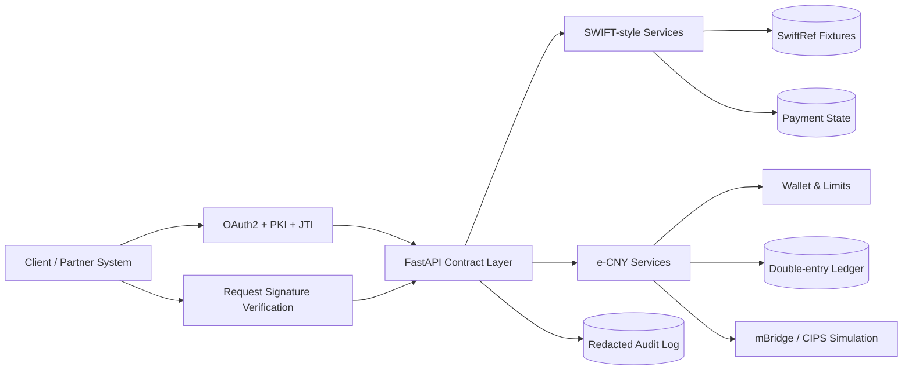

<div align="center">

# 00SWIFT

**A contract-aligned SWIFT API and e-CNY cross-border payment sandbox**

[](https://github.com/24373054/00SWIFT/actions/workflows/ci.yml)
[](https://github.com/24373054/00SWIFT/actions/workflows/codeql.yml)
[](https://www.python.org/)
[](https://fastapi.tiangolo.com/)
[](LICENSE)
[](https://github.com/24373054/00SWIFT/releases)

A local-first research and integration environment for OAuth2/PKI-protected SWIFT-style APIs and a ledger-backed digital-yuan cross-border payment prototype.

[Quick start](#quick-start) · [Architecture](docs/ARCHITECTURE.md) · [API guide](docs/API.md) · [Security](SECURITY.md) · [Operations](docs/OPERATIONS.md)

</div>

> [!IMPORTANT]
> 00SWIFT is an independent technical sandbox. It is not affiliated with, endorsed by, or connected to SWIFT, the People's Bank of China, CIPS, mBridge, or any participating institution. It does not connect to production financial infrastructure by default and must not be used to move real funds.

## Why this project exists

Real payment integrations are difficult to prototype safely: authentication is certificate-bound, messages are contract-heavy, state transitions are asynchronous, and operational mistakes can be expensive. 00SWIFT provides one coherent environment in which teams can:

- exercise OAuth2 JWT-bearer grants, PKI identities, request signatures, replay protection, and canonical error envelopes;
- build against SWIFT-inspired Pre-validation, SwiftRef, GPI Tracker, and Messaging routes;
- model e-CNY wallets, issuance/redemption, double-entry accounting, compliance flags, and cross-border routing;
- switch between a fully local sandbox and guarded pilot/live forwarding paths without changing the client contract;
- test failure modes before integrating with institutional infrastructure.

## Capabilities

| Area | Included | Design notes |
| --- | --- | --- |
| Authentication | JWT-bearer OAuth2, RS256 client assertions, JTI replay protection, revocation | Secrets are salted and hashed; access tokens are stored as digests |
| Request integrity | `X-SWIFT-Signature`, digest verification, certificate identity binding | Signed write routes validate the exact request body |
| SWIFT-style APIs | Pre-validation v2, SwiftRef v4, GPI Tracker v4, Alliance Cloud Messaging v2 | Canonical base paths and structured error envelopes |
| e-CNY | Tiered wallets, mint/burn, exchange, transfers, mBridge/CIPS simulations | Integer fen amounts and a double-entry ledger |
| Compliance | KYC gates, wallet limits, large/cross-border/suspicious flags | Extensible hooks, not a production AML decision engine |
| Operations | Health/readiness probes, bounded/redacted audit logging, Docker | Sandbox/pilot/live environment profiles |
| Quality | Python 3.11/3.12 matrix, 50 tests, coverage gate, Ruff, Bandit, CodeQL | CI and release validation are repository-enforced |

## Architecture at a glance



The backend is intentionally modular: transport/authentication, contract adapters, domain services, persistence, and the static frontend are separated. See [Architecture](docs/ARCHITECTURE.md) for trust boundaries and invariants.

## Quick start

### Prerequisites

- Python 3.11 or 3.12
- Node.js only for the optional frontend syntax check
- Docker 24+ for the container workflow

### Native development

```bash
git clone https://github.com/24373054/00SWIFT.git
cd 00SWIFT
python -m venv .venv

# Linux/macOS
source .venv/bin/activate
# Windows PowerShell
# .venv\Scripts\Activate.ps1

python -m pip install --upgrade pip
python -m pip install -r backend/requirements-dev.txt
cp backend/.env.example backend/.env
cd backend
python -m uvicorn main:app --host 127.0.0.1 --port 8765 --reload
```

Open:

- UI: `http://127.0.0.1:8765/`
- OpenAPI: `http://127.0.0.1:8765/docs`
- Liveness: `http://127.0.0.1:8765/health`
- Readiness: `http://127.0.0.1:8765/ready`

On Windows, `start.bat` provides the same sandbox startup path.

### Docker

```bash
cp backend/.env.example backend/.env
docker compose up --build
```

The compose profile stores SQLite data and generated sandbox certificates in named volumes.

## Configuration

All settings are environment driven. Copy `backend/.env.example` and review every value before using pilot or live mode.

| Variable | Purpose | Sandbox default |
| --- | --- | --- |
| `SWIFT_ENV` | `sandbox`, `pilot`, or `live` | `sandbox` |
| `DB_URL` | SQLAlchemy database URL | `sqlite:///swift_dev.db` |
| `ADMIN_API_TOKEN` | Protects internal `/api/*` and sandbox e-CNY routes | Empty only in local sandbox |
| `CERTS_DIR` | Generated or supplied certificate material | `certs` |
| `CORS_ORIGINS` | Comma-separated browser origins | Localhost only |
| `AUDIT_BODY_LIMIT` | Maximum audited request-body bytes | `4096` |
| `LIVE_HOST_*` | Upstream hosts for guarded forwarding | Empty |

Pilot/live startup fails closed when mandatory settings are missing. Production secrets and certificates must be supplied through a secret manager or mounted files, never committed.

## API families

| Family | Base path | Typical scope |
| --- | --- | --- |
| OAuth2 | `/oauth2` | Client authentication |
| Pre-validation | `/swift-preval/v2` | `swift.preval` |
| SwiftRef | `/swiftrefdata/v4` | `swift.swiftref` |
| GPI Tracker | `/swift-apitracker/v4` | Viewer/update scopes |
| Messaging | `/alliancecloud/v2` | `swift.messaging` |
| e-CNY | `/ecny/v1` | `ecny.wallet`, `ecny.issuance`, `ecny.bridge`, `ecny.ledger` |
| Internal administration | `/api` | `X-Admin-Token` |

The complete request flow, signature rules, endpoint inventory, and examples are in [docs/API.md](docs/API.md).

## Development checks

```bash
make install-dev
make check
make test
make coverage
make security
```

Equivalent commands:

```bash
ruff check backend
ruff format --check backend
python -m compileall -q backend
bandit -q -r backend -c pyproject.toml
pytest -q
pytest --cov=backend --cov-report=term-missing --cov-fail-under=68
node --check frontend/app.js
```

## Security model

The sandbox now enforces several invariants that are easy to accidentally weaken:

1. Client secrets are stored as salted PBKDF2 hashes and revealed only once.
2. Access tokens are stored as deterministic digests; raw bearer tokens are returned only to the caller.
3. Signed endpoints verify the exact body and do not fall back to an empty payload.
4. JTI values are persisted to reject replayed client assertions.
5. Audit logs redact credentials, assertions, tokens, and sensitive nested fields.
6. Wallet balances and issuance are derived from balanced ledger entries rather than mutable caches.
7. Sandbox convenience authentication is never silently carried into pilot/live mode.

Read [SECURITY.md](SECURITY.md) before exposing the service beyond localhost.

## Project status

Version **2.1.0** is a hardened research beta. The API surface is useful for integration tests and architecture exploration, but it is not a replacement for official specifications, certification, legal review, operational controls, or regulated infrastructure.

Planned work is tracked through GitHub Issues. High-value directions include PostgreSQL migrations, asynchronous job processing, HSM/KMS integration, official-schema conformance suites, tamper-evident audit storage, and deployment reference architectures.

## Documentation

- [Architecture and invariants](docs/ARCHITECTURE.md)
- [API integration guide](docs/API.md)
- [Operations runbook](docs/OPERATIONS.md)
- [Threat model](docs/THREAT_MODEL.md)
- [Design baseline](docs/DESIGN.md)
- [Release process](docs/RELEASE.md)
- [Contributing](CONTRIBUTING.md)
- [Changelog](CHANGELOG.md)

## Contributing and responsible disclosure

Contributions are welcome through focused pull requests with tests. See [CONTRIBUTING.md](CONTRIBUTING.md). Do not open public issues for suspected vulnerabilities; follow [SECURITY.md](SECURITY.md).

## License

Licensed under the [Apache License 2.0](LICENSE).
