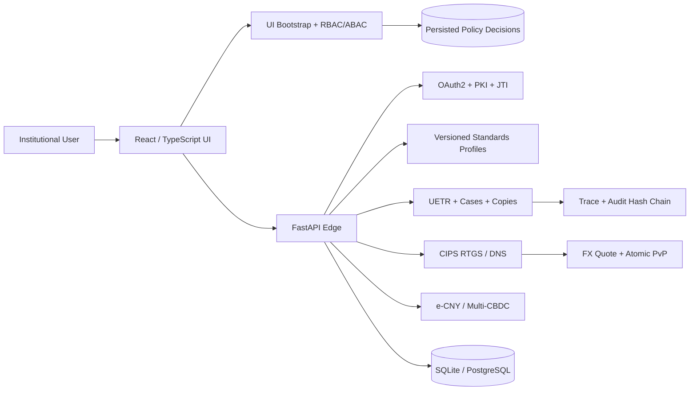

<div align="center">

# 00SWIFT

## Cross-Border Payment Infrastructure Lab

**A standards-driven SWIFT, CIPS, e-CNY and multi-CBDC payment infrastructure research platform**

[](https://github.com/24373054/00SWIFT/actions/workflows/ci.yml)
[](https://github.com/24373054/00SWIFT/actions/workflows/migrations.yml)
[](https://github.com/24373054/00SWIFT/actions/workflows/codeql.yml)
[](https://github.com/24373054/00SWIFT/releases)
[](LICENSE)

A local-first environment for standards conformance, authenticated payment APIs,
transaction lifecycles, CIPS settlement research, ledger-backed digital currency,
atomic PvP and institutional operations visualisation.

[Quick start](#quick-start) · [Frontend v4](docs/FRONTEND_V4_DESIGN_BRIEF.md) · [V3 platform](docs/NEXTGEN.md) · [Architecture](docs/ARCHITECTURE.md) · [API guide](docs/API.md) · [Security](SECURITY.md)

</div>

> [!IMPORTANT]
> 00SWIFT is an independent technical sandbox. It is not affiliated with, endorsed by, connected to, or certified by SWIFT, CIPS, the People's Bank of China, HKMA, BIS Innovation Hub, mBridge, or any participating institution. It does not contain production participant directories or restricted implementation guides, and it must not be used to move real funds.

## What version 4 adds

Version 4 introduces **Cross-Border Payment Infrastructure Lab**, an institutional
operating interface intended for government, bank, CIPS and partner demonstrations,
research, training and controlled long-term sandbox use.

- **Institutional frontend:** Vite, React 19 and strict TypeScript with graphite,
  ivory and restrained burgundy Daylight and Operations Dark themes.
- **Role-aware workflows:** Command Center, Payments, Investigations, Settlement,
  Standards, Digital Currency, Risk & Policy, Developer and Administration.
- **Backend-authoritative access control:** persisted RBAC/ABAC decisions, reasons,
  obligations, redactions and policy versions.
- **Operational spatial model:** semantic 3D settlement infrastructure with complete
  2D and Reduced Motion alternatives.
- **Connected visualisations:** global corridors, UETR lifecycle, RTGS liquidity,
  DNS netting, atomic PvP, jurisdiction policy, ISO 20022 structure and Transaction
  Copy diff/hash-chain inspection.
- **Deterministic replay:** live and scenario modes use the same components and state
  semantics, avoiding a separate presentation-only dashboard.
- **Reproducible delivery:** frontend typecheck/test/build gates, multi-stage Docker
  build, release-bundle packaging and independent post-publication validation.

The previous developer console remains available at `/legacy` during migration.

## Platform capabilities

| Area | Included | Key invariant |
| --- | --- | --- |
| Identity and integrity | JWT-bearer OAuth2, PKI identity, JTI protection, revocation, exact-body signatures | Persisted secrets and tokens are non-reusable digests |
| Standards | ISO 20022 base 2026, CBPR+ 2025, CBPR+ SR2026, CIPS 2026 research profile | Findings identify profile, rule, path, severity and version |
| Messages | `pacs.008`, `pacs.009`, `pacs.002`, `pacs.004`, `camt.056`, `camt.029`, `camt.110`, `camt.111`, `admi.024` | Hardened XML parsing and deterministic adapters |
| Payment lifecycle | UUIDv4 UETR, guarded transitions, copies, lineage, cases and SLAs | Optimistic concurrency and copy-chain integrity |
| CIPS research | Participants, route ranking, accounts, RTGS queues, DNS netting, Payment Lens | No overdraft; DNS applies only after all-debit liquidity checks |
| e-CNY | Double-entry ledger, two-tier issuance, wallet tiers, HK retail, offline value | Ledger-authoritative integer-fen balances |
| Programmable money | Allow-listed subsidy, category, expiry, staged, escrow, refund and approval templates | No arbitrary-code execution |
| Multi-CBDC and FX | Jurisdictions, policy, nodes, quote expiry/capacity and two-leg PvP | Both legs commit or both abort |
| Runtime | Idempotency, outbox, durable workflows, dead-letter state and leases | Retry-safe and crash-recoverable state transitions |
| Institutional UI | Role workspaces, decision envelopes, live overlays and replay | Hidden UI is never treated as authorization |
| Persistence | SQLite development profile, PostgreSQL runtime, Alembic migrations | Both database engines complete migration round trips in CI |

## Architecture at a glance



The platform does not collapse SWIFT messaging, CIPS clearing, e-CNY value and
multi-CBDC settlement into one generic channel. Each domain has distinct states,
participants, policies and finality rules.

## Quick start

### Prerequisites

- Python 3.11 or 3.12
- Node.js 22
- Docker 24+ for container workflows
- PostgreSQL 16+ for the durable deployment profile

### Native development

```bash
git clone https://github.com/24373054/00SWIFT.git
cd 00SWIFT

python -m venv .venv
source .venv/bin/activate  # Windows PowerShell: .venv\Scripts\Activate.ps1
python -m pip install --upgrade pip
python -m pip install -r backend/requirements-dev.txt

npm install --prefix frontend --no-audit --no-fund
npm run typecheck --prefix frontend
npm run test --prefix frontend
npm run build --prefix frontend

cp backend/.env.example backend/.env
alembic upgrade head
cd backend
python -m uvicorn main:app --host 127.0.0.1 --port 8765 --reload
```

Open:

- Institutional UI: `http://127.0.0.1:8765/`
- Legacy developer console: `http://127.0.0.1:8765/legacy`
- OpenAPI: `http://127.0.0.1:8765/docs`
- Liveness: `http://127.0.0.1:8765/health`
- Readiness: `http://127.0.0.1:8765/ready`

### Docker

```bash
cp backend/.env.example backend/.env
docker compose up --build
```

The Docker image builds and tests the frontend in an isolated Node stage, then
copies only the production bundle into the non-root Python runtime image.

## Configuration

| Variable | Purpose | Sandbox default |
| --- | --- | --- |
| `SWIFT_ENV` | `sandbox`, `pilot`, or `live` | `sandbox` |
| `DB_URL` | SQLAlchemy URL; PostgreSQL recommended outside local development | `sqlite:///swift_dev.db` |
| `ADMIN_API_TOKEN` | Protects administration, NextGen and institutional UI contracts | Empty only in local sandbox |
| `LOCAL_KMS_MASTER_KEY` | Enables the development-only local KMS adapter | Empty |
| `CERTS_DIR` | Generated or supplied certificate material | `certs` |
| `CORS_ORIGINS` | Comma-separated browser origins | Localhost only |
| `AUDIT_BODY_LIMIT` | Maximum audited request-body bytes | `4096` |
| `LIVE_HOST_*` | Upstream hosts for guarded forwarding | Empty |

Pilot/live startup fails closed when mandatory settings are missing. Trusted
identity headers for institutional UI contracts must only be accepted behind an
authenticated gateway and the administration-token boundary.

## API families

| Family | Base path | Purpose |
| --- | --- | --- |
| OAuth2 | `/oauth2` | Client authentication and revocation |
| SWIFT-style APIs | `/swift-preval/v2`, `/swiftrefdata/v4`, `/swift-apitracker/v4`, `/alliancecloud/v2` | Validation, reference data, tracking and messaging |
| e-CNY baseline | `/ecny/v1` | Wallet, issuance, ledger, bridge and compliance operations |
| Standards/runtime | `/nextgen/v1/standards`, `/nextgen/v1/runtime` | Profiles, conformance and durable outbox |
| Payment lifecycle | `/nextgen/v1/payments`, `/nextgen/v1/cases` | UETR, copies, cases, quality and timelines |
| CIPS research | `/nextgen/v1/cips` | Participants, routing, RTGS and DNS |
| CBDC/PvP | `/nextgen/v1/hk-retail`, `/nextgen/v1/offline`, `/nextgen/v1/programmable`, `/nextgen/v1/cbdc`, `/nextgen/v1/pvp` | Retail, offline, programmable, multi-CBDC and PvP |
| Platform controls | `/nextgen/v1/policy`, `/nextgen/v1/kms`, `/nextgen/v1/reconciliation`, `/nextgen/v1/audit` | Policy, keys, reconciliation and audit integrity |
| Institutional UI | `/nextgen/v1/ui` | Role bootstrap, authorization and Command Center read models |

## Verification

```bash
ruff check backend
ruff format --check backend
pytest --cov=backend --cov-fail-under=68
bandit -q -r backend -c pyproject.toml

npm run typecheck --prefix frontend
npm run test --prefix frontend
npm run build --prefix frontend

docker build -t 00swift:local .
alembic upgrade head
alembic downgrade base
alembic upgrade head
```

Every release is published only after main CI and same-commit CodeQL success.
The immutable tag is then rebuilt and validated independently, with release asset
SHA-256 verification.
