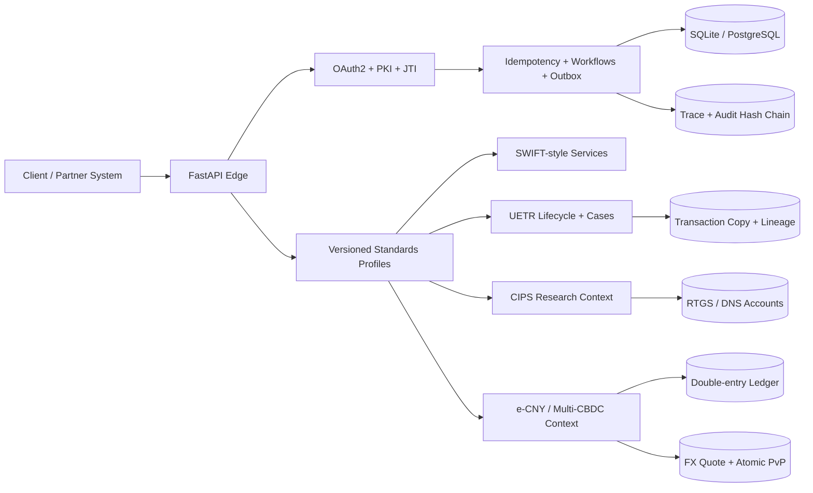

<div align="center">

# 00SWIFT

**A standards-driven SWIFT, CIPS, e-CNY, and multi-CBDC payment research platform**

[](https://github.com/24373054/00SWIFT/actions/workflows/ci.yml)
[](https://github.com/24373054/00SWIFT/actions/workflows/migrations.yml)
[](https://github.com/24373054/00SWIFT/actions/workflows/codeql.yml)
[](https://www.python.org/)
[](https://fastapi.tiangolo.com/)
[](LICENSE)
[](https://github.com/24373054/00SWIFT/releases)

A local-first environment for standards conformance, authenticated payment APIs,
end-to-end transaction lifecycles, ledger-backed digital currency, and atomic
cross-border settlement research.

[Quick start](#quick-start) · [V3 platform](docs/NEXTGEN.md) · [Architecture](docs/ARCHITECTURE.md) · [API guide](docs/API.md) · [Security](SECURITY.md) · [Operations](docs/OPERATIONS.md)

</div>

> [!IMPORTANT]
> 00SWIFT is an independent technical sandbox. It is not affiliated with, endorsed by, connected to, or certified by SWIFT, CIPS, the People's Bank of China, HKMA, BIS Innovation Hub, mBridge, or any participating institution. It does not contain production participant directories or restricted implementation guides, and it must not be used to move real funds.

## What version 3 adds

00SWIFT began as a contract-aligned SWIFT API and e-CNY prototype. Version 3
turns it into a standards-driven research platform with four separate bounded
contexts:

- **SWIFT-style integration:** OAuth2/PKI, exact-body signatures, Pre-validation,
  SwiftRef fixtures, GPI-style tracking, messaging, and structured errors.
- **ISO 20022 and CBPR+:** versioned profiles, SR2026 structured/hybrid address
  rules, Business Application Header integrity, nine payment/investigation
  message families, and deterministic conformance vectors.
- **CIPS and e-CNY research:** synthetic participant routing, RTGS and DNS
  settlement, two-tier issuance, wallet limits, Hong Kong retail behavior,
  offline value, and constrained programmable money.
- **Multi-CBDC settlement:** jurisdictional policy, participant nodes, FX quotes,
  atomic payment-versus-payment, privacy-preserving identifiers, durable
  workflows, KMS interfaces, audit chains, and reconciliation.

## Capabilities

| Area | Included | Design notes |
| --- | --- | --- |
| Identity and integrity | JWT-bearer OAuth2, PKI identity, JTI replay protection, revocation, exact-body signatures | Secrets are salted and hashed; bearer tokens are persisted only as digests |
| Standards profiles | ISO 20022 base 2026, CBPR+ 2025, CBPR+ SR2026, CIPS 2026 research profile | Every finding includes profile, rule, path, severity, and effective version |
| Message families | `pacs.008`, `pacs.009`, `pacs.002`, `pacs.004`, `camt.056`, `camt.029`, `camt.110`, `camt.111`, `admi.024` | JSON/XML behavioral adapters with hardened XML parsing |
| Payment lifecycle | UUIDv4 UETR, guarded transitions, cover inheritance, transaction copies, field lineage, cases and SLAs | Hash-chain integrity and optimistic concurrency are enforced |
| CIPS research | Direct/indirect participants, route ranking, settlement accounts, RTGS queues, DNS netting, Payment Lens | Synthetic behavior only; no production directory or certification claim |
| e-CNY | Double-entry ledger, central-bank/operator issuance, wallet tiers, HK retail profile, offline value | Integer fen values and ledger-authoritative balances |
| Programmable money | Directed subsidy, merchant category, expiry, staged release, escrow, refund, multi-approval | Allow-listed deterministic templates; no arbitrary-code VM |
| Multi-CBDC and FX | Jurisdictions, policy, nodes, quote expiry/capacity, two-leg PvP | Both legs commit or the workflow aborts |
| Runtime | Idempotency, transactional outbox, durable workflows, dead-letter state, database leases | Designed for retry and crash recovery |
| Platform security | RBAC/ABAC decisions, KMS/HSM protocol, authenticated local provider, trace context, audit hash chain | Local key provider is development-only |
| Persistence | SQLite development profile, PostgreSQL runtime, Alembic migrations | Both databases run migration round trips in CI |
| Quality | Python 3.11/3.12, 93 tests, 68% coverage gate, Ruff, Bandit, CodeQL, Docker smoke tests | Release publication is gated by main CI and same-commit CodeQL |

## Architecture at a glance



The contexts intentionally do not collapse SWIFT, CIPS, e-CNY, and mBridge into
one generic “channel.” Each has independent participants, policies, states, and
settlement invariants.

## Quick start

### Prerequisites

- Python 3.11 or 3.12
- Node.js for the optional frontend syntax check
- Docker 24+ for container workflows
- PostgreSQL 16+ for the durable deployment profile

### Native development

```bash
git clone https://github.com/24373054/00SWIFT.git
cd 00SWIFT
python -m venv .venv

# Linux/macOS
source .venv/bin/activate
# Windows PowerShell
# .venv\Scripts\Activate.ps1

python -m pip install --upgrade pip
python -m pip install -r backend/requirements-dev.txt
cp backend/.env.example backend/.env
alembic upgrade head
cd backend
python -m uvicorn main:app --host 127.0.0.1 --port 8765 --reload
```

Open:

- UI: `http://127.0.0.1:8765/`
- OpenAPI: `http://127.0.0.1:8765/docs`
- Liveness: `http://127.0.0.1:8765/health`
- Readiness: `http://127.0.0.1:8765/ready`

### Docker

```bash
cp backend/.env.example backend/.env
docker compose up --build
```

## Configuration

All settings are environment driven. Copy `backend/.env.example` and review
every value before using pilot or live mode.

| Variable | Purpose | Sandbox default |
| --- | --- | --- |
| `SWIFT_ENV` | `sandbox`, `pilot`, or `live` | `sandbox` |
| `DB_URL` | SQLAlchemy URL; PostgreSQL recommended outside local development | `sqlite:///swift_dev.db` |
| `ADMIN_API_TOKEN` | Protects `/api/*` and next-generation management routes | Empty only in local sandbox |
| `LOCAL_KMS_MASTER_KEY` | Enables the development-only local KMS adapter | Empty |
| `CERTS_DIR` | Generated or supplied certificate material | `certs` |
| `CORS_ORIGINS` | Comma-separated browser origins | Localhost only |
| `AUDIT_BODY_LIMIT` | Maximum audited request-body bytes | `4096` |
| `LIVE_HOST_*` | Upstream hosts for guarded forwarding | Empty |

Pilot/live startup fails closed when mandatory settings are missing. Production
keys belong in an HSM/KMS or secret manager, never in source control.

## API families

| Family | Base path | Purpose |
| --- | --- | --- |
| OAuth2 | `/oauth2` | Client authentication and revocation |
| Pre-validation | `/swift-preval/v2` | SWIFT-style payment checks |
| SwiftRef | `/swiftrefdata/v4` | Synthetic BIC, IBAN, currency, and country fixtures |
| GPI Tracker | `/swift-apitracker/v4` | Payment and cancellation state |
| Messaging | `/alliancecloud/v2` | Deterministic sandbox messaging |
| e-CNY baseline | `/ecny/v1` | Wallet, issuance, ledger, bridge, and compliance operations |
| Standards and runtime | `/nextgen/v1/standards`, `/nextgen/v1/runtime` | Profiles, validation, conformance, and outbox |
| Payment lifecycle | `/nextgen/v1/payments`, `/nextgen/v1/cases` | UETR, copies, cases, quality, and timelines |
| CIPS research | `/nextgen/v1/cips` | Participants, routing, validation, RTGS, and DNS |
| CBDC research | `/nextgen/v1/hk-retail`, `/nextgen/v1/offline`, `/nextgen/v1/programmable`, `/nextgen/v1/cbdc`, `/nextgen/v1/pvp` | Retail, offline, programmable, multi-CBDC, and PvP |
| Platform controls | `/nextgen/v1/policy`, `/nextgen/v1/kms`, `/nextgen/v1/reconciliation`, `/nextgen/v1/audit` | Explainable policy, key abstraction, reconciliation, and integrity |
| Internal administration | `/api` | Local management plane protected by `X-Admin-Token` |

## Development and verification

```bash
make install-dev
make check
make test
make coverage
make security

alembic upgrade head
alembic downgrade base
alembic upgrade head
```

The GitHub pipeline additionally performs:

- Python 3.11 and 3.12 regression testing;
- Ruff lint and canonical formatting;
- Python compilation and frontend JavaScript parsing;
- Bandit and Python/JavaScript CodeQL;
- SQLite and PostgreSQL migration round trips;
- non-root Docker build plus live `/health` and `/ready` probes;
- release-candidate or published-asset verification;
- source archive, dependency snapshot, and SHA-256 validation after publication.

## Security and financial invariants

1. Client secrets are stored as salted hashes and revealed only once.
2. Access tokens are stored as digests; raw bearer values are not recoverable.
3. Signed routes verify the exact transmitted body.
4. Standards profiles are explicit and versioned; historical behavior remains reproducible.
5. Every payment lifecycle and case transition is allow-listed and version checked.
6. Transaction copies and operational evidence form independently verifiable hash chains.
7. Wallet, operator, RTGS, DNS, offline, programmable, and PvP value movements use authoritative ledger or settlement-account state.
8. RTGS and e-CNY accounts cannot be overdrawn; DNS applies only after every net debit is fundable.
9. Offline vouchers are reserved online and redeem exactly once.
10. Programmable instruments cannot execute arbitrary code or alter monetary supply.
11. Both PvP legs commit together or the settlement enters an aborted state.
12. Policy and quality results are explainable evidence, not automated legal or regulatory conclusions.

Read [SECURITY.md](SECURITY.md) and the [threat model](docs/THREAT_MODEL.md)
before exposing the service beyond localhost.

## Project status

Version **3.0.0** is a standards-driven research beta. It is intended for
architecture exploration, conformance experiments, integration tests, payment
lifecycle research, and deterministic failure simulation. It is not a substitute
for official specifications, licensed implementation guides, certification,
legal review, operating rules, sanctions data, production security controls, or
regulated financial infrastructure.

## Documentation

- [Next-generation platform](docs/NEXTGEN.md)
- [Lifecycle, CIPS, and two-tier e-CNY invariants](docs/BATCH2_LIFECYCLE.md)
- [Architecture and invariants](docs/ARCHITECTURE.md)
- [API integration guide](docs/API.md)
- [Operations runbook](docs/OPERATIONS.md)
- [Threat model](docs/THREAT_MODEL.md)
- [Release process](docs/RELEASE.md)
- [v3.0.0 release notes](docs/releases/v3.0.0.md)
- [Contributing](CONTRIBUTING.md)
- [Changelog](CHANGELOG.md)

## Contributing and responsible disclosure

Contributions are welcome through focused pull requests with tests. See
[CONTRIBUTING.md](CONTRIBUTING.md). Do not open public issues for suspected
vulnerabilities; follow [SECURITY.md](SECURITY.md).

## License

Licensed under the [Apache License 2.0](LICENSE).
