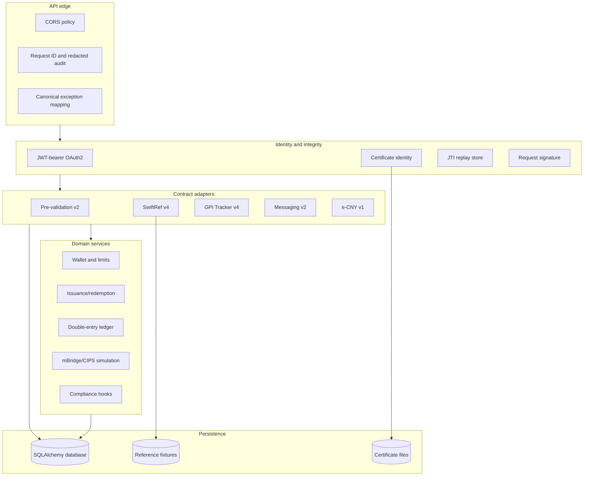

# Architecture

## System intent

00SWIFT is a modular integration sandbox. It reproduces important behavioral contracts—authentication, signatures, error envelopes, reference lookups, asynchronous payment states, double-entry accounting, and cross-border routing—without claiming production certification or institutional connectivity.

## Component map

## Request lifecycle

1. `RequestContextMiddleware` establishes or propagates `X-Request-ID`.
2. CORS is evaluated against configured origins.
3. The route authenticates with either OAuth scope dependencies or the explicitly local/admin path.
4. Signed writes read the exact body bytes and verify the signature digest and certificate binding.
5. Pydantic validates the transport contract before domain logic runs.
6. Domain services enforce financial and compliance invariants.
7. Database changes commit atomically; failures roll back.
8. Responses or exceptions are mapped to stable envelopes.
9. The audit record stores bounded, recursively redacted metadata.

## Trust boundaries

### Public protocol boundary

`/oauth2/*`, `/swift-preval/*`, `/swiftrefdata/*`, `/swift-apitracker/*`, `/alliancecloud/*`, and `/ecny/v1/*` represent client-facing contracts. Inputs are hostile until authenticated, authorized, parsed, and validated.

### Administrative boundary

`/api/*` creates credentials, injects fixtures, and exposes operational state. These routes are local conveniences, not a management plane for internet exposure. Pilot/live modes require a configured admin token and should additionally be protected by network and identity controls.

### Upstream boundary

Pilot/live hosts are external trust domains. Forwarded requests require independent TLS verification, certificate lifecycle management, egress controls, timeout/retry policies, and contract validation. The repository does not make an upstream safe merely because its URL is configured.

## Financial invariants

- Monetary values are integer minor units (`fen` for CNY).
- Every posted transaction contains at least two entries.
- Total debits equal total credits per currency and transaction.
- Wallet balance is derived from ledger entries.
- A source cannot spend beyond its ledger balance.
- Issuance outstanding is derived from monetary authority and non-central-bank positions, not wallet transfers.
- Failed operations roll back all entries and state transitions.
- Limits are checked for both outgoing and incoming effects.

## Identity invariants

- Application secrets are never stored in plaintext.
- Bearer tokens are returned once and persisted only as hashes/digests.
- Client assertions must be signed, certificate-bound, audience-correct, time-valid, and unique by JTI.
- Requested scopes must be a subset of the credential's allow-list.
- Revocation can affect only tokens owned by the authenticated client.
- Signed requests cannot substitute or omit the body used to compute the signature.

## Data model overview

- `AppCredential`: client identity, hashed secret, certificate, scopes.
- `OAuthToken`: digest, owner, scopes, expiry/revocation state.
- `JtiRecord`: replay-protection window.
- `ApiRequest`: bounded/redacted audit event.
- `PaymentState`, `FinMessage`, `MessageDistribution`: SWIFT-style state and messaging fixtures.
- `EcnyWallet`, `EcnyAccount`, `EcnyTransaction`, `EcnyEntry`: e-CNY identity and accounting.
- `BridgeTransaction`, `ComplianceReport`: cross-border and compliance simulation state.
- SwiftRef tables: seeded BIC, IBAN, currency, and country reference data.

## Extension points

- Replace SQLite with PostgreSQL and a migration tool.
- Replace filesystem keys with HSM/KMS-backed signing interfaces.
- Add official-schema adapters without changing domain services.
- Export audit events to an append-only event store/SIEM.
- Add durable queues for asynchronous status transitions and callbacks.
- Implement pluggable policy engines for limits, sanctions, and transaction monitoring.
